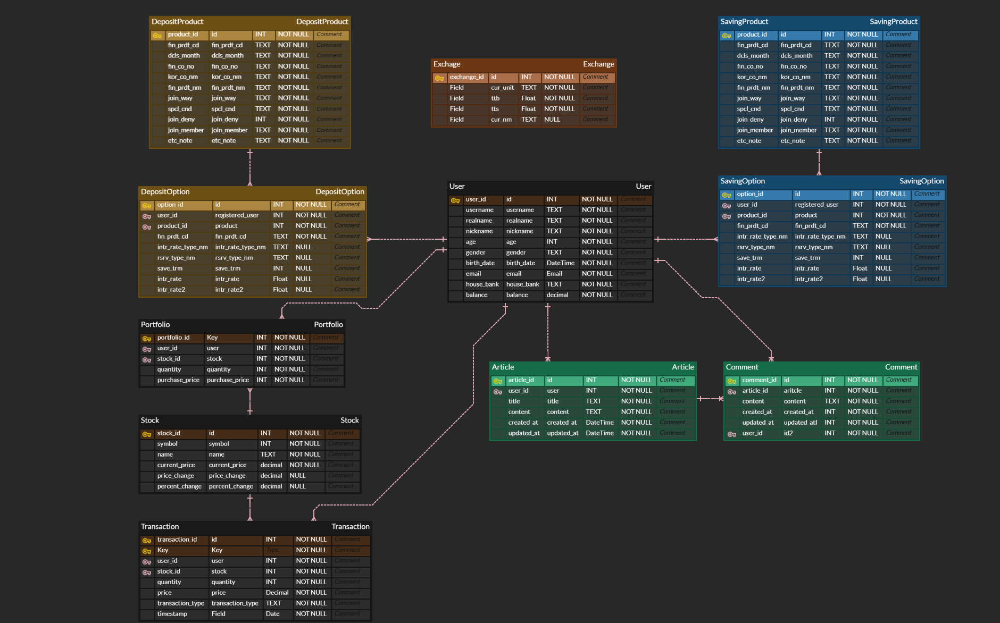

# Wish-Cash
'Wishcash'는 'Wish'와 'Cash'의 합성어로 고객의 금융적 소망을 실현하고자 하는 팀의 목표를 반영합니다. 'Wish'는 고객의 다양한 금융적 필요와 바람을 의미하며, 'Cash'는 이를 실현하기 위한 재정적 지원을 상징합니다. 따라서 'Wishcash'는 고객의 금융적 소망을 현실로 만들어주는 팀이라는 의미를 담고 있습니다.

# 🙋‍♀️ 팀 소개
| 이름     | 역할                                   |
|----------|----------------------------------------|
| 최유정 팀장 | 회원 커스터마이징, 게시판, 프로필, 은행 찾기, 전반적인 UI/UX 디자인 |
| 박수미 팀원 | 예적금 조회, 환율 계산기, Chatbot, 알고리즘 추천 상품          |

# 📆 일정 및 진행상황 관리
https://www.notion.so/Team-Wish-Cash-124abb529d0080329ac4d3f00bc19125

# ✏️ 설계
### 디자인 목업

### ERD

# 금융 상품 추천 알고리즘
### 내 나이대 및 같은 성별의 사용자들이 가장 많이 가입한 상품 추천받기
- 사용자가 회원가입시 입력한 나이를 기반으로 상품 추천 
- WISH CASH 내의 사용자들이 가장 많이 가입한 상품 3개 추천 

# 🖥️ 서비스 기능
### 예적금 조회
- 은행별, 금리순, 가입조건에 따른 상품 조회

### 주변 은행 찾기
- kakaoMap API 활용
- 장소 검색 시 해당 장소 주변 은행 출력
- 은행명 검색 시 현재 지역에 있는 해당 은행 출력
- 은행명 클릭 시 상세 페이지 전환

### 환율 계산기
- 송금 받을 때, 송금 보낼 때, 매매 기준율 기준

### 금융 상품 알고리즘 추천
- 비슷한 나이대의 사용자들이 많이 가입한 상품 3가지를 추천

### 커뮤니티
- 고객센터 
- 사용자 간 소통 플랫폼 (게시글 및 댓글 작성)

### 주식게임

- 기본 자금을 얻고 시작
- 자금 내에서 자유롭게 매도, 매수 가능
- 매일 최신 데이터를 받아와 차액을 계산하여 반영

### 마이 페이지
- 내가 쓴 게시글 조회 
- 개인정보 및 비밀번호 변경
- 회원탈퇴
- 사용자가 가입한 금융 상품 리스트 및 금리 그래프 출력 

### 챗봇

- DB에 저장된 금융상품 데이터를 학습
-  해당 데이터에 기반한 효율적인 소통이 가능

# ⏱️ 작업 
### 11/18
- 사이트 전체 기획 및 ERD 작성
- 컴포넌트 구조 생성
- 업무 분담 

### 문제점 개선 및 논의 사항
- 팀원과 상의 결과 프론트와 백의 통신 과정을 전반적으로 이해하는 과정이 필요하다고 생각하여 합의 하에 ‘프론트/백’이 아닌 기능별로 업무를 분담. 
- 전반적인 일정을 세웠지만 유동적으로 세부 일정을 변경할 수 있음으로 이해하고, 진행 상황을 적극적으로 공유하고, 유동적으로 조절할 것으로 합의.

## 
### 11/19
- 회원가입, 로그인 페이지 
- 예/적금 조회 프론트/백 구현 완료
- 환율 계산 페이지 기능 구현 완료

### 문제점 개선 및 논의 사항
- 회원 커스터마이징(회원가입, 로그인, 로그아웃, 회원탈퇴, 프로필)이 생각보다 지체되어서 우선
예정된 날짜(20일)까지 최대한 진행 후 조율 예정.
- 구현하면서 model이 수정되는 경우가 있어서 ERD, 명세는 기능 구현하면서 조금씩 수정하는 것으로 합의.

##
### 11/20
- 예/적금 조회, 환율계산 페이지 전체 완료
- 챗봇 백 구현완료 
- 회원 커스터마이징, 프로필페이지 백 구현완료

### 문제점 개선 및 논의 사항
- 전반적으로 예상된 날짜에 맞게 진행되고 있으며, 회원 커스터마이징이 조금 늦어지지만 기능 구현까지는 완료된 상태로
크게 지체된 것 없음.
- 환률정보를 그래프로 구현 가능한지 확인 필요 

##
### 11/21
- 회원 커스터마이징 기능 구현이 완료되었으나 로그아웃 토큰 문제, 사이트를 나갈 시 자동 로그아웃 기능 문제, 로그인 상태에서 로그인 페이지에 접근하는 문제 발견
- 게시판은 고객센터로 활용하기로 결정
- AI 알고리즘 추천은 나이와 성별에 맞는 상품 추천 결정

### 문제점 개선 및 논의 사항
설계가 완벽하지 않았기에 설계되지 않은 부분에서 버벅임이 있어서 회의를 통해 정리할 필요가 있음.

##
### 11/ 22
- 주변 은행 찾기 완료
- 금융 상품 가입 폼 완료
- 메인 페이지 전반적인 테마 구성 진행 중

### 문제점 개선 및 논의 사항
- 로그아웃 토큰 문제는 전체적인 접속 관리를 바꿔야해서 보류 상태 
- 상품 알고리즘 추천은 좀 더 세세히 회의 후 진행 예정
- 전반적인 기능 구현이 거의 끝나가고, 통합 과정을 거칠 예정

##
### 11/23
- 게시판 기능 구현 진행 중(댓글 작성 남음)
- 상품 알고리즘 추천 기능 구현 중
- 메인 페이지 및 전반적인 프론트 작업 진행 중

### 문제점 개선 및 논의 사항
- 각 기능들을 합치는 과정에서 오류 발생
- username을 이름으로 쓰고 user_id를 만들려고 했으나 로그인 과정에서 오류 발생 -> username을 아이디로 쓰고 realname 필드 추가함

##
### 11/24
- 게시판 완료
- 전반적인 프론트 진행 중
- 상품 알고리즘 추천 점검 중
- 주식 게임 기능 구현 진행 중

### 문제점 개선 및 논의 사항
- 환율계산기의 디자인 상 예상했던 메인페이지에 배치 불가 -> 디자인 수정 예정

# 소감
